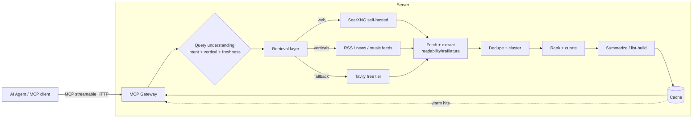

# Web Content Search MCP — Architecture & Design

> Status: **Draft for review** · Date: 2026-06-16 · Branch: `claude/mcp-web-content-search-unvdt9`
>
> A free "search engine for AI agents." Any MCP-capable assistant (Claude, ChatGPT,
> Cursor, Gemini, …) connects once and can ask for fresh, ranked **content lists** —
> "top news today", "what's new in songs this week", "best reviewed espresso machines" —
> and get back a clean, structured, citation-bearing list it can show or read to the user.

---

## 1. What we're building (and why it's different from a normal web-search tool)

Most "web search" MCP servers return a flat list of `{title, url, snippet}` — the same
ten blue links a search engine gives a human. That's useful, but it pushes all the hard
work (open each page, read it, dedupe, decide what matters, summarize) back onto the
agent, which burns tokens and is slow and unreliable.

This server does the **whole content-curation pipeline server-side** and returns a
finished, ranked **content list**:

```
Agent → "top tech news today"  →  [ MCP server ]  →  ranked list of items, each with:
                                                       title, source, url, published_at,
                                                       1–2 line summary, why-it-matters,
                                                       thumbnail (opt), tags
```

So the agent's job shrinks to: call one tool, render the list. That is the product.

### Goals
- **One tool call → a usable list.** Search + fetch + extract + dedupe + rank + summarize, server-side.
- **Free to the agent/user** ("free like Google"). Cost, if any, sits with whoever runs the server.
- **Fresh.** Time-sensitive verticals (news, music, releases) must reflect *today*.
- **Cited.** Every item carries its source URL and publish time — no hallucinated facts.
- **Tool-agnostic.** Pure MCP over streamable HTTP; works with every client this repo already documents.

### Non-goals (at least for v1)
- Not a general crawler/indexer of the whole web (we ride existing search backends).
- Not a research agent — no multi-hop reasoning; it returns lists, the calling agent reasons.
- Not a paywalled-content bypass. We respect robots/ToS and only use legally fetchable content.

---

## 2. Primary use cases

| Query (natural language)              | Vertical     | What "good" looks like                                              |
|---------------------------------------|--------------|--------------------------------------------------------------------|
| "top news today"                      | News         | 8–12 items from diverse reputable outlets, last 24h, deduped by story |
| "what's new in songs this week"       | Music        | New releases / trending tracks, with artist + platform links       |
| "latest in AI / what's new in <topic>"| Topic news   | Recent, on-topic, source-diverse                                   |
| "best <product> right now"            | Commerce/reviews | Recently-reviewed items with rating signal                     |
| "trending on <platform>"              | Social/trends| Time-boxed trending list                                            |

The shape is always the same: **a ranked, time-aware, deduped, cited list**. The vertical
just changes *which* sources we prefer and *how* we rank.

---

## 3. High-level architecture



**Pipeline stages**

1. **Query understanding** — classify intent → vertical (news/music/products/generic),
   extract topic + time window ("today", "this week"), and a result count. Cheap and rule-based
   first; optionally a tiny LLM classifier later.
2. **Retrieval** — fan out to the configured backends (see §5). Vertical queries prefer curated
   feeds; generic queries hit web search.
3. **Fetch + extract** — pull the candidate pages, strip boilerplate/ads/nav to clean main
   text + metadata (title, author, publish time, lead image).
4. **Dedupe + cluster** — collapse the same story told by 5 outlets into one item (URL canonicalization
   + title/content similarity).
5. **Rank + curate** — score by freshness, source diversity/authority, relevance, engagement signals.
6. **Summarize / list-build** — produce the 1–2 line summary + "why it matters" per item and assemble
   the final list.
7. **Cache** — memoize by (normalized query, vertical, time-bucket) so popular queries are ~free and instant.

---

## 4. The MCP contract (what the agent actually sees)

Keep the surface tiny — agents pick the right tool more reliably with fewer, well-named tools.

### Tool: `search_content`
The everyday tool. One call, a finished list.

```jsonc
// input
{
  "query": "top tech news today",
  "vertical": "auto",            // auto | news | music | products | web   (default: auto)
  "freshness": "auto",           // auto | day | week | month | any
  "limit": 10,                   // 1–25
  "summaries": true,             // include per-item summary + why_it_matters
  "region": "US",                // optional locale hint
  "lang": "en"
}
```

```jsonc
// structured output
{
  "query": "top tech news today",
  "vertical": "news",
  "generated_at": "2026-06-16T00:00:00Z",
  "items": [
    {
      "rank": 1,
      "title": "…",
      "url": "https://…",
      "source": "Ars Technica",
      "published_at": "2026-06-15T22:10:00Z",
      "summary": "One or two sentences.",
      "why_it_matters": "Optional editorial hook.",
      "thumbnail": "https://…",       // optional
      "tags": ["ai", "chips"],
      "cluster_size": 4               // how many outlets covered this story
    }
  ],
  "sources_used": ["searxng", "rss:techmeme", "..."],
  "cache": "miss"                      // hit | miss | partial
}
```

### Tool: `fetch_page` (secondary)
For when the agent wants the full cleaned text of one item from a list ("read me #3 in full").
Returns extracted main content + metadata, not raw HTML.

### Tool: `list_verticals` (discovery)
Returns supported verticals + the freshness windows each supports, so the agent self-documents.

> **Design choice:** return both human-readable text *and* `structuredContent` (per the MCP
> spec) so chat-only clients can show the list verbatim while programmatic clients parse it.

---

## 5. Search backend — the "free like Google" core, compared

This is the crux. The retrieval layer is **pluggable**; the question is what to default to.
Costs/limits below are current as of **2026-06** (they move — see Sources).

| Backend | Cost / free-ness | Reliability | Coverage / quality | Keys/ops | Legal posture | Verdict |
|---|---|---|---|---|---|---|
| **Self-hosted SearXNG** (metasearch over Google/Bing/DDG/Brave/70+ engines) | **Truly free** — you host it; no per-query fee | Medium — depends on upstreams + your IP reputation; needs rotation/retry | Broad (aggregates many engines), good general web | You run a container; no API keys | Gray-ish: scrapes engine result pages; fine self-hosted/low-volume, upstreams may rate-limit | **Primary** |
| **RSS / Atom + vertical feeds/APIs** (news outlets, Techmeme, MusicBrainz/ListenBrainz, iTunes RSS, Reddit/HN, etc.) | **Free** | **High** — feeds are meant to be consumed | Excellent *within a vertical*, time-stamped, clean | Mostly keyless; a few free keys | **Clean** — publishers offer feeds for this purpose | **Primary for verticals** |
| **Tavily free tier** | Free **1,000 credits/mo, no card**, indefinite | High (managed API) | Good, LLM-optimized results + content | One API key | Clean (licensed API) | **Fallback / enrichment** |
| **Brave Search API** | **No longer free** for new users (2026): ~$5 metered credits then paid | High | Independent index, strong | API key + card | Clean | Optional paid upgrade only |
| **Bing / Google CSE** | Limited/declining free, then paid | High | Excellent | API key (+billing) | Clean | Optional paid |
| **DuckDuckGo HTML scrape (direct)** | Free | Low–Medium — aggressive rate limiting/captcha | OK | None | Gray, brittle | Avoid as primary |
| **Build our own crawler+index** | "Free" but huge infra/eng cost | You own it | Whatever you crawl | Massive ops | You must honor robots | Out of scope for v1 |

### Recommendation: a **layered retrieval** strategy (not one backend)

```
1. Vertical feeds first   →  for news/music/etc., curated RSS/APIs give the cleanest,
                             most time-accurate, most legally-clean results. Free + reliable.
2. SearXNG (self-hosted)  →  for generic/long-tail web queries. Free, broad. The
                             "free like Google" engine. Add retry + multi-instance/rotation.
3. Tavily free tier       →  graceful fallback when SearXNG is rate-limited or thin, and
                             for content enrichment. 1k/mo free is plenty for an MVP.
4. (optional) Brave/Bing  →  drop-in paid backend behind the same interface if/when volume
                             outgrows the free options.
```

This gives you genuinely-free operation at MVP scale, the best freshness for the headline
verticals (news/music), and a clean upgrade path to paid search if the thing takes off —
**without changing the MCP contract or the agent integration.** "Free like Google" is real
at small/medium scale; at large scale the honest cost model is in §10.

---

## 6. Content extraction, dedupe, ranking (the part that makes it feel curated)

- **Extraction:** strip boilerplate to clean main text + metadata (title, author, `published_at`,
  lead image). Best-in-class options are Python's **Trafilatura** / Readability; this is a strong
  reason to lean Python (see §7).
- **Dedupe/cluster:** canonicalize URLs (drop tracking params, follow AMP→canonical), then cluster
  by title/embedding similarity so "same story, 6 outlets" becomes one item with `cluster_size`.
- **Ranking score** (tunable per vertical):
  `score = w_fresh·recency + w_auth·source_authority + w_div·diversity_bonus + w_rel·relevance + w_eng·engagement`
  - News weights recency + source diversity heavily; products weight rating/recency; generic weights relevance.
- **Summaries:** template-based extractive summary for $0, or an optional small-LLM pass
  (Claude Haiku) for nicer 1-liners + "why it matters". Make it a config flag so the server can run
  with zero LLM cost.

---

## 7. Language / runtime recommendation

**Recommendation: Python + FastMCP** (official Python MCP SDK), streamable-HTTP transport.

Why Python wins *for this specific server*:
- The hard part is **content extraction + feed parsing**, where Python's ecosystem is best-in-class
  and battle-tested: **Trafilatura**, **readability-lxml**, **feedparser**, **BeautifulSoup**,
  **httpx** (async). This is the bulk of the engineering.
- **FastMCP** makes the MCP layer a thin decorator over those functions; async `httpx` handles the
  fan-out concurrency well.
- Easiest path to add a small ML/embedding step for clustering/ranking later.

**TypeScript (official `@modelcontextprotocol/sdk`)** is the credible alternative and is the more
"default" MCP path (and matches the hosted-server style this repo already documents). Choose TS if
the team is JS-first and willing to give up some extraction-library quality (Mozilla Readability +
`rss-parser` are good but Trafilatura is better). **Either can ship the same MCP contract** — the
contract in §4 is language-neutral, so this is reversible.

Net: **Python for best content quality with least effort; TS if you strongly prefer one runtime
across the stack.** I'll default to Python in the implementation plan unless you say otherwise.

---

## 8. Caching, rate-limiting, scaling

- **Cache key:** `(normalized_query, vertical, freshness_bucket, region, lang)`. TTL by freshness:
  news ~5–10 min, weekly ~1 h, evergreen ~24 h. A warm hit returns in ~tens of ms and costs $0.
- **Pre-warm** the obvious queries ("top news today") on a cron so the common case is always hot.
- **Per-backend rate limiting + circuit breakers:** if SearXNG starts getting throttled, trip to
  Tavily automatically; never hard-fail the agent.
- **Concurrency:** bounded async fan-out (e.g. fetch top N candidates in parallel with a semaphore).
- **Storage:** Redis (cache + rate counters) + object store for thumbnails/extracted text.

---

## 9. Security & trust (MCP-specific — important)

Scraped web content is **untrusted input flowing straight to an LLM agent** — a classic
**prompt-injection** vector ("ignore previous instructions…" hidden in a page). Mitigations:

- Return scraped text as **clearly-delimited data**, never as instructions; the server never executes
  anything found on a page.
- Strip/escape active content; cap per-item length; keep summaries extractive by default.
- Domain allow/deny lists + source-authority scoring naturally down-rank junk/SEO-spam/malware sites.
- Rate-limit per client; no SSRF (validate/resolve URLs, block internal ranges) on `fetch_page`.
- Honor `robots.txt` and per-site ToS; respect `noai`/`noindex` signals; identify with an honest UA.

## 10. Cost model — is it *really* "free like Google"?

- **For the user/agent: yes, free.** They make MCP calls, no keys, no bill.
- **For the operator:** at MVP scale it's near-zero — SearXNG + feeds + Tavily-free + a small VM +
  Redis. Real costs appear at scale: egress/compute for fetching, optional paid search backends, and
  optional LLM summarization. The layered design lets you stay free as long as possible and turn on
  paid backends per-query only when needed. Sustainability options later: caching hard (most queries
  are duplicates), sponsor/ads-free goodwill, or a generous-free + paid-overage tier.

---

## 11. Packaging & distribution (how it reaches agents)

Mirror what this repo already does for BatonDeck:
- Host the server at e.g. `https://mcp.<name>.com/mcp` (streamable HTTP).
- Ship a **plugin** in this marketplace (`plugins/<name>/.mcp.json` + a short skill/command) so
  Claude Code / Cursor / Desktop / Codex / Gemini install instructions are copy-paste, exactly like
  the BatonDeck README. The §4 tools become available the moment the client connects.

---

## 12. MVP scope & phased roadmap

**Phase 0 — MVP (free, single vertical + generic):**
- `search_content` with `vertical=news` (RSS-driven) + generic web via self-hosted SearXNG.
- Extraction (Trafilatura), URL-canonical dedupe, recency+diversity ranking, extractive summaries.
- In-memory/Redis cache. Streamable-HTTP MCP server. No LLM dependency.

**Phase 1 — ✅ done:** music vertical (iTunes RSS / ListenBrainz / MusicBrainz) on top of
music news feeds; Tavily fallback + thumbnails (Phase 0); `fetch_page` enrichment for thin
feed/search summaries; optional Claude Haiku summaries + "why it matters" (config-flagged,
extractive/free by default — latest Haiku model); per-client rate limiting + per-backend
circuit breakers (SearXNG throttled → Tavily). Still runs with zero API keys (RSS-only).

**Phase 2:** more verticals (products/reviews, trends), embedding-based clustering, ranking tuning,
pre-warming cron, dashboards, paid-backend upgrade path, the marketplace plugin.

## 13. Open questions for you
1. **Hosting** — where should the server live (your existing infra/domain, a new one)? Any brand name?
2. **Verticals priority** — confirm news + music first; anything else early (products, finance, sports)?
3. **LLM summaries** — OK to use Claude Haiku for nicer summaries (small cost), or stay 100% free/extractive?
4. **Stack** — Python/FastMCP (my recommendation) or TypeScript?
5. **Distribution** — ship it as a plugin in *this* repo, or as its own repo + marketplace?

---

### Sources (free-tier facts, 2026)
- Brave Search API free tier removed / metered billing (2026): [implicator.ai](https://www.implicator.ai/brave-drops-free-search-api-tier-puts-all-developers-on-metered-billing/), [costbench](https://costbench.com/software/ai-search-apis/brave-search-api/free-plan/)
- Tavily free plan — 1,000 credits/month, no card: [Tavily Docs](https://docs.tavily.com/documentation/api-credits), [costbench](https://costbench.com/software/web-scraping/tavily/free-plan/)
- SearXNG self-hosted metasearch + MCP bridge: [mcpservers.org](https://mcpservers.org/servers/OvertliDS/mcp-searxng-enhanced), [selfhostsetup](https://selfhostsetup.com/posts/searxng-private-metasearch-engine/)
</content>
</invoke>
